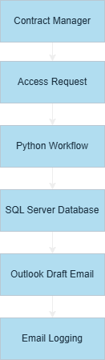
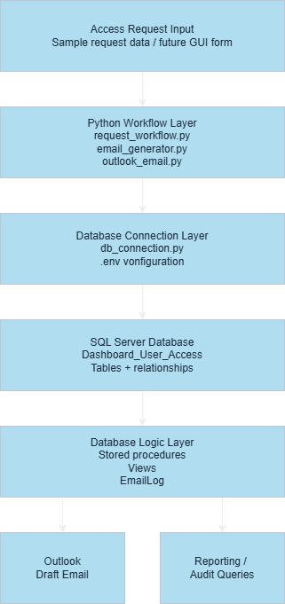
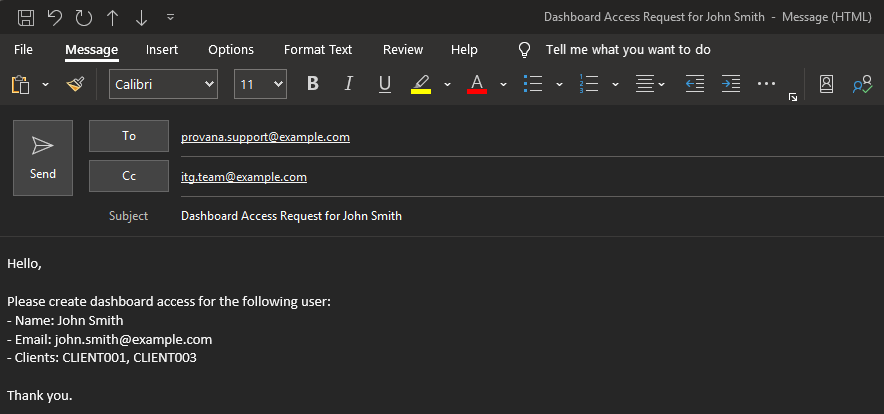

# Dashboard Access Tracker


## Project Overview

This project is a relational database and workflow automation system designed to track third-party dashboard access requests.

The original business process relied heavily on:
- Manual emails
- Spreadsheet tracking
- Limited audit visibility
- No centralized relational database structure

This project improves:
- Access request tracking
- Client access relationships
- Workflow visibility
- Email logging
- Historical auditing
- Future automation readiness

The system was designed as a portfolio-safe demonstration project using fake/sample data only.

<br>

## Business Problem

Contract managers request dashboard access for users who need visibility into specific client accounts.

The actual dashboard access is managed externally by a third-party provider. Internal teams must:
- Receive the request
- Track the request
- Email the third-party provider
- Track request status
- Track which users have access to which clients

Originally, this process was tracked primarily through spreadsheets and email history.


## Project Goals

- Build a normalized relational database in SQL Server
- Create reusable reporting views
- Create stored procedures for workflow automation
- Prepare the system for Python and Outlook automation
- Build a future GUI for internal request management
- Create a portfolio-quality backend systems project

<br>

## Current System Capabilities

The current system includes:

 - SQL Server relational database backend
 - Stored procedures for workflow operations
 - Python orchestration workflow
 - Outlook email draft automation
 - Email logging
 - Multi-client request handling
 - Jupyter Notebook walkthrough
 - GitHub version control
 - Environment variable configuration using `.env`

<br>

## Technologies Used

- SQL Server
- SQL Server Management Studio (SSMS)
- T-SQL
- VS Code
- GitHub
- Python
- pyodbc
- pandas
- Jupyter Notebook
- Outlook COM Automation (pywin32)
- Git
- GitHub

<br>

### Python Workflow Architecture

### `db_connection.py`

Handles SQL Server database connectivity and connection management.

### `request_workflow.py`

Main orchestration workflow for processing access requests.

### `email_generator.py`

Builds standardized email content.

### `outlook_email.py`

Creates Outlook draft emails automatically.

<br>

## Database Concepts

- Relational database design
- Primary keys
- Foreign keys
- Junction tables
- Many-to-many relationships
- Views
- Stored procedures
- Workflow state tracking
- Audit logging

<br>

## Database Workflow

Dashboard User Request Flow:

1. Contract manager requests dashboard access
2. Internal team creates dashboard user record
3. Internal team creates access request
4. Requested client relationships are added
5. Email is sent to third-party provider
6. Email activity is logged
7. Request is marked completed after confirmation

<br>

## Workflow Diagram

<p style="margin-left: 100px;">
  
</p>

<br>

## Architecture Diagram

<p style="margin-left: 20px;">
  
</p>

<br>

## Screenshots

### Outlook Draft Email



<br>

## Current Database Objects

### Tables

- ContractManagers
- DashboardUsers
- Clients
- AccessRequests
- AccessRequestClients
- UserClientAccess
- EmailLog

### Views

- vw_UserClientAccess
- vw_AccessRequests
- vw_AccessRequestClients
- vw_EmailLog

### Stored Procedures

- usp_CreateDashboardUser
- usp_CreateAccessRequest
- usp_AddClientToAccessRequest
- usp_LogAccessRequestEmail
- usp_MarkAccessRequestCompleted

<br>

## Project Structure

```text
dashboard-access-tracker/
│
├── README.md
│
├── sql/
│   ├── 01_create_tables.sql
│   ├── 02_insert_sample_data.sql
│   ├── 03_create_views.sql
│   ├── 04_test_queries.sql
│   ├── 05_stored_procedures.sql
│   └── 06_test_stored_procedures.sql
│
├── notebooks/
│
├── src/
│
├── docs/
│
└── sample_data/
```

<br>

## Setup Instructions

### 1. Clone the repository
```bash
git clone https://github.com/arroyoHub/dashboard-access-tracker.git
```

### 2. Open the project folder

```bash
cd dashboard-access-tracker
```

### 3. Create a virtual environment

```bash
python -m venv .venv
```

### 4. Activate the virtual environment

Windows PowerShell:

```bash
.\.venv\Scripts\Activate.ps1
```

### 5. Install dependencies

```bash
pip install -r requirements.txt
```

### 6. Configure environment variables

Create a `.env` file in the project root using `.env.example` as a template.

Example:

```env
DB_SERVER=YOUR_SERVER_NAME
DB_NAME=YOUR_DATABASE_NAME
```

### 7. Execute SQL setup scripts

Run the SQL scripts in order:

1. 01_create_tables.sql
2. 02_insert_sample_data.sql
3. 03_create_views.sql
4. 05_stored_procedures.sql

### 8. Run the workflow script

```bash
python src/request_workflow.py
```

### 9. Optional notebook walkthrough

Open:

```text
notebooks/access_tracker_walkthrough.ipynb
```

<br>

## Portfolio Safety

This repository contains:
- Fake names
- Fake emails
- Fake client codes
- No company data
- No internal server names
- No production credentials

This project is intended strictly for educational and portfolio demonstration purposes.

<br>

## Future Enhancements

Planned future improvements include:

- GUI interface for request management
- Automated status update workflow
- Reporting dashboard integration
- Access removal workflow
- Role-based access controls
- Power BI reporting integration
- Approval workflow tracking
- Automated notification system

<br>

## Author

Christian Arroyo

GitHub:
https://github.com/arroyoHub